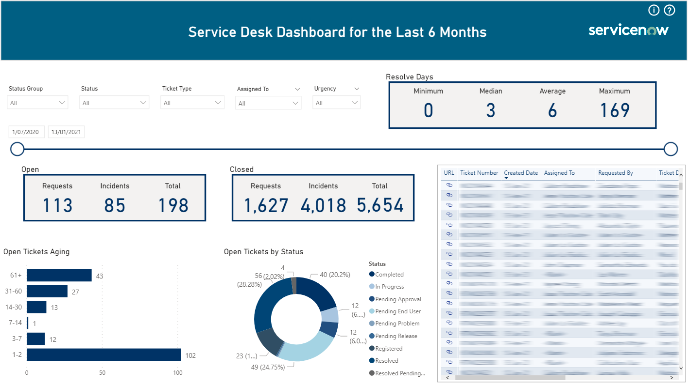
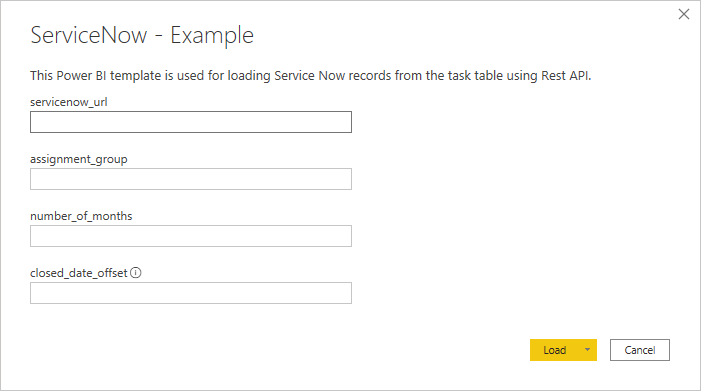
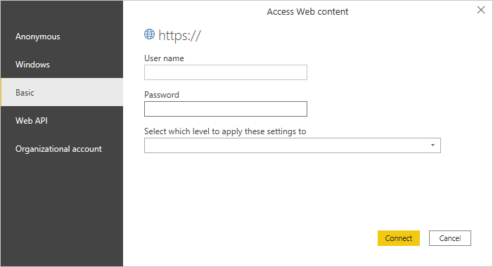

# Service Now Power BI Template
  
This Power BI template is used for loading Service Now records from the task table using Rest API. I used [Alberto Colombo's blog post](https://blog.kofko.xyz/connect-servicenow-and-powerbi) as a reference to create this template.

<h1 align="left">
  
</h1>


## References:
* https://developer.servicenow.com/dev.do#!/reference/api/orlando/rest/c_TableAPI
* https://docs.servicenow.com/bundle/kingston-platform-user-interface/page/use/common-ui-elements/reference/r_OpAvailableFiltersQueries.html


## Dependencies
<br>
  
|Software                                   |Dependency                 |
|:------------------------------------------|:--------------------------|
|[Power BI Desktop](https://powerbi.microsoft.com/en-us/downloads/)|Template|
|[Power BI Desktop](https://community.powerbi.com/t5/Themes-Gallery/University-of-Melbourne/td-p/163417)|Theme|
<br>

## Glossary of Terms
<br>
  
| Term                      | Meaning                                                                                  |
|:--------------------------|:-----------------------------------------------------------------------------------------|
| Rest API       |A REST API (also known as RESTful API) is an application programming interface (API or web API) that conforms to the constraints of REST architectural style and allows for interaction with RESTful web services. REST stands for representational state transfer and was created by computer scientist Roy Fielding.|
| Service Now   |A ticketing tool that processes and catalogs customer service requests. You can raise requests that deal with incidents, changes, problems, and other services.|

<br>


## Functionality 
This template requires the user to enter parameters as per the following screen.

<h1 align="left">
  
</h1>

* servicenow_url = https://YOUR_COMPANY_NAME.service-now.com/
* assignment_group = Only one assignment group e.g. "Service Desk"
* number_of_months = Start small, it depends on how many records are returned. I find 6 months works for me to return about 6,000 records without a connection failure.
* closed_date_offset = Used to offset the closed date updated by the system so it better reflects when the status is updated to a completed/closed status. I find 3 works well.

<br>

The first connection will require some credentials: you can use your local ServiceNow credentials or a service account

<h1 align="left">
  
</h1>

<br>
  
## Rest API call examples

### Number of months:

```
= Json.Document(Web.Contents(servicenow_url & "/api/now/table/task?
sysparm_display_value=true
&sysparm_query=sys_class_nameINsc_req_item,incident
^sys_created_onONLast%20" & number_of_months & "%20months
%40javascript%3Ags.beginningOfLast" & number_of_months & "Months()
%40javascript%3Ags.endOfLast" & number_of_months & "Months()
&assignment_group=" & assignment_group & "
&numberISNOTEMPTY
&sysparm_exclude_reference_link=true
&sysparm_fields=sys_id
%2Cactive
%2Capproval_set
%2Cclosed_at
%2Cdue_date
%2Cnumber
%2Copened_at
%2Cshort_description
%2Csla_due
%2Csys_class_name
%2Csys_created_on
%2Csys_updated_on
%2Cu_service_area
%2Curgency
%2Cassignment_group
%2Cu_requestor
%2Cassigned_to
%2Cstate
%2Cu_affected_user"))
```

### Between 2 dates:

```
= Json.Document(Web.Contents(servicenow_url & "/api/now/table/task?
sysparm_display_value=true
&sysparm_query=sys_class_nameINsc_req_item,incident
^sys_created_onBETWEEN
javascript:gs.dateGenerate('" & Date.ToText(start_date, "yyyy-MM-dd") & "','00:00:00')@
javascript:gs.dateGenerate('" & Date.ToText(end_date, "yyyy-MM-dd") & "','00:00:00')
&assignment_group=" & assignment_group & "
&numberISNOTEMPTY
&sysparm_exclude_reference_link=true
&sysparm_fields=sys_id
%2Cactive
%2Capproval_set
%2Cclosed_at
%2Cdue_date
%2Cnumber
%2Copened_at
%2Cshort_description
%2Csla_due
%2Csys_class_name
%2Csys_created_on
%2Csys_updated_on
%2Cu_service_area
%2Curgency
%2Cassignment_group
%2Cu_requestor
%2Cassigned_to
%2Cstate
%2Cu_affected_user"))
```
