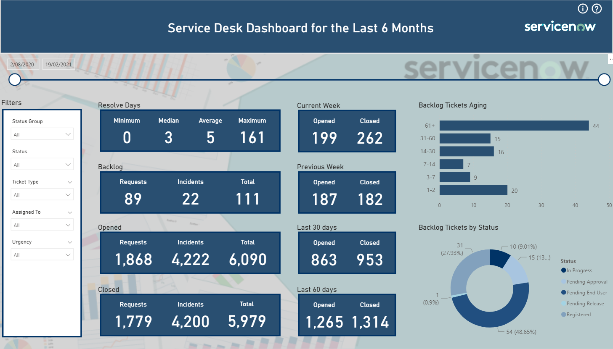

# Service Now Power BI Template
  
This Power BI template is used for loading Service Now records from the task table using Rest API. I used [Alberto Colombo's blog post](https://blog.kofko.xyz/connect-servicenow-and-powerbi) as a reference to create the template.

<h1 align="left">
  
</h1>

## References:
* https://developer.servicenow.com/dev.do#!/reference/api/orlando/rest/c_TableAPI
* https://docs.servicenow.com/bundle/kingston-platform-user-interface/page/use/common-ui-elements/reference/r_OpAvailableFiltersQueries.html

## Dependencies
 
  
|Software                                   |Dependency                 |
|:------------------------------------------|:--------------------------|
|[Power BI Desktop](https://powerbi.microsoft.com/en-us/downloads/)|Template|
|[Power BI Theme](https://community.powerbi.com/t5/Themes-Gallery/University-of-Melbourne/td-p/163417)|Template|
|[Snagit](http://discover.techsmith.com/snagit-non-brand-desktop/?gclid=CNzQiOTO09UCFVoFKgod9EIB3g)|Read Me|
 

## Glossary of Terms
 
  
| Term                      | Meaning                                                                                  |
|:--------------------------|:-----------------------------------------------------------------------------------------|
| Rest API |A REST API (also known as RESTful API) is an application programming interface (API or web API) that conforms to the constraints of REST architectural style and allows for interaction with RESTful web services. REST stands for representational state transfer and was created by computer scientist Roy Fielding.|

 

## Functionality 
This template requires the user to enter parameters as per the following screen.

<h1 align="left">
  
</h1>

* servicenow_url = https://YOUR_COMPANY_NAME.service-now.com/
* assignment_group = Only one assignment group e.g. "Service Desk"
* number_of_months = Start small, it depends on how many records are returned. I find 6 months works for me to return about 5,000 records without a connection failure.
